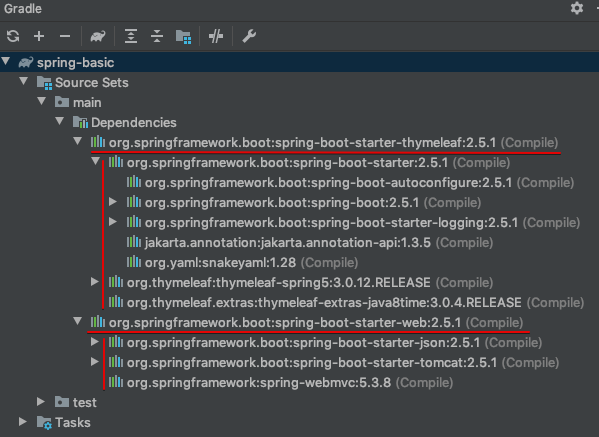
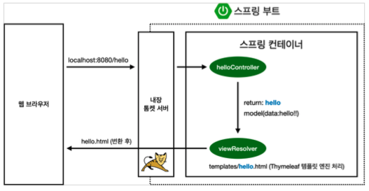
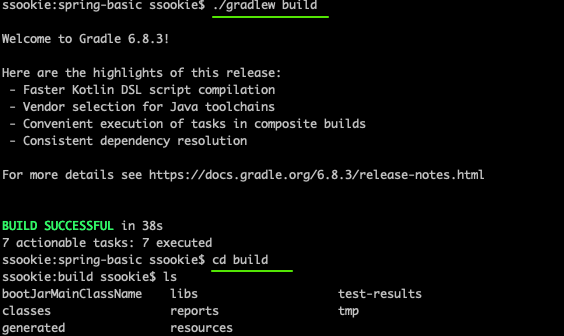

# Chapter 01 "프로젝트 환경설정"

## 1. 프로젝트 생성

### 1.1. 스프링 부트 스타터 사이트에서 스프링 프로젝트 생성
* https://start.spring.io
* Add Dependencies... : 어떤 라이브러리를 땡겨서 쓸 것이냐
    * Spring Web: Web 프로젝트 만들기
    * Thyemeleaf: html을 만들어주는 템플릿 엔진
* maven/gradle: 필요한 라이브러리를 땡겨오고, 빌드하는 라이플사이클까지 관리
* Project Metadata
    * Group
    * Artifact - 프로젝트 빌드명
* 동작 확인
    * 기본 메인 클래스 실행
    * 자체으로 내장하고 있는 tomcat 웹서버를 띄우면서 실행
```
INFO 12640 --- [           main] o.s.b.w.embedded.tomcat.TomcatWebServer  : Tomcat started on port(s): 8080 (http) with context path ''
```

#### [참고] IntelliJ Gradle 대신에 자바 직접 실행
* 최근 IntelliJ 버전은 Gradle을 통해서 실행 하는 것이 기본 설정이나  이렇게 하면 실행속도가 느리다.
* 다음과 같이 변경하면 자바로 바로 실행해서 실행속도가 더 빠르다.
* Preferences > Build, Execution, Deployment > Build Tools > Gradle 
    * Build and run using: Gradle → IntelliJ IDEA
    * Run tests using: Gradle → IntelliJ IDEA

#### [참고] [Spring 빌드 관리 도구 Maven과 Gradle 비교하기](https://jisooo.tistory.com/entry/Spring-%EB%B9%8C%EB%93%9C-%EA%B4%80%EB%A6%AC-%EB%8F%84%EA%B5%AC-Maven%EA%B3%BC-Gradle-%EB%B9%84%EA%B5%90%ED%95%98%EA%B8%B0)
##### Gradle이 Maven보다 좋은점
* Build라는 동적인 요소를 XML로 정의하기에는 어려운 부분이 많다.
    * 설정 내용이 길어지고 가독성 떨어짐
    * 의존관계가 복잡한 프로젝트 설정하기에는 부적절
    * 상속구조를 이용한 멀티 모듈 구현
    * 특정 설정을 소수의 모듈에서 공유하기 위해서는 부모 프로젝트를 생성하여 상속하게 해야함 (상속의 단점 생김)
* Gradle은 그루비를 사용하기 때문에, 동적인 빌드는 Groovy 스크립트로 플러그인을 호출하거나 직접 코드를 짜면 된다.
    * Configuration Injection 방식을 사용해서 공통 모듈을 상속해서 사용하는 단점을 커버했다.
    * 설정 주입시 프로젝트의 조건을 체크할 수 있어서 프로젝트별로 주입되는 설정을 다르게 할 수 있다.
* 스크립트 언어로 구성되어 있기때문에, XML과 달리 변수선언, if, else, for등의 로직이 구현가능하여 간결하게 구성 가능하다.
* Gradle은 메이븐보다 최대 100배 빠르다.

## 2. 라이브러리 살펴보기
> Gradle은 의존관계가 있는 라이브러리를 함께 다운로드 한다.



## 2.1. 스프링 부트 라이브러리

* spring-boot-starter-web 
    * spring-boot-starter-tomcat: 톰캣 (내장 웹서버를 가지고 있음)
    * spring-webmvc: 스프링 웹 MVC
* spring-boot-starter-thymeleaf: 타임리프 템플릿 엔진(View) 
* spring-boot-starter(공통): 스프링 부트 + 스프링 코어 + 로깅
    * spring-boot
        * spring-core
    * spring-boot-starter-logging 
        * logback, slf4j

## 2.2. 테스트 라이브러리
* spring-boot-starter-test
    * junit: 테스트 프레임워크
    * mockito: 목 라이브러리
    * assertj: 테스트 코드를 좀 더 편하게 작성하게 도와주는 라이브러리 
    * spring-test: 스프링 통합 테스트 지원

## 3. View 환경설정

### 3.1. Welcome Page 만들기
* 스프링 부트가 제공하는 Welcome Page 기능 - static/index.html 을 올려두면 Welcome page 기능을 제공한다.
* https://docs.spring.io/spring-boot/docs/current/reference/html/features.html#features.developing-web-applications.spring-mvc.static-content

### 3.2. thymeleaf 템플릿 엔진
* [thymeleaf 공식 사이트](https://www.thymeleaf.org/)
* [스프링 공식 튜토리얼](https://spring.io/guides/gs/serving-web-content/)
* [스프링부트 메뉴얼](https://docs.spring.io/spring-boot/docs/current/reference/html/features.html#features.developing-web-applications.spring-mvc.template-engines)

### 3.3. thymeleaf 템플릿엔진 동작


* 컨트롤러에서 리턴 값으로 문자를 반환하면 뷰 리졸버(`viewResolver`)가 화면을 찾아서 렌더링 처리한다. 
    * 스프링 부트 템플릿엔진 기본 viewName 매핑
    * `resources:templates/` +{ViewName}+ `.html`

#### [참고] spring-boot-devtools 라이브러리를 추가하면
* html 파일을 컴파일만 해주면 서버 재시작 없이 View 파일 변경이 가능하다.
* 인텔리J 컴파일 방법: 메뉴 > build > Recompile

## 04. 빌드하고 실행하기
```shell script
# 필요한 라이브러리 다운받아 빌드하기
$ ./gradlew build
```

```shell script
$ cd build/libs
$ java -jar hello-spring-0.0.1-SNAPSHOT.jar # 실행

# clean: build 폴더 자체가 사라짐
$ ./gradlew clean
$ ./gradlew build
```
