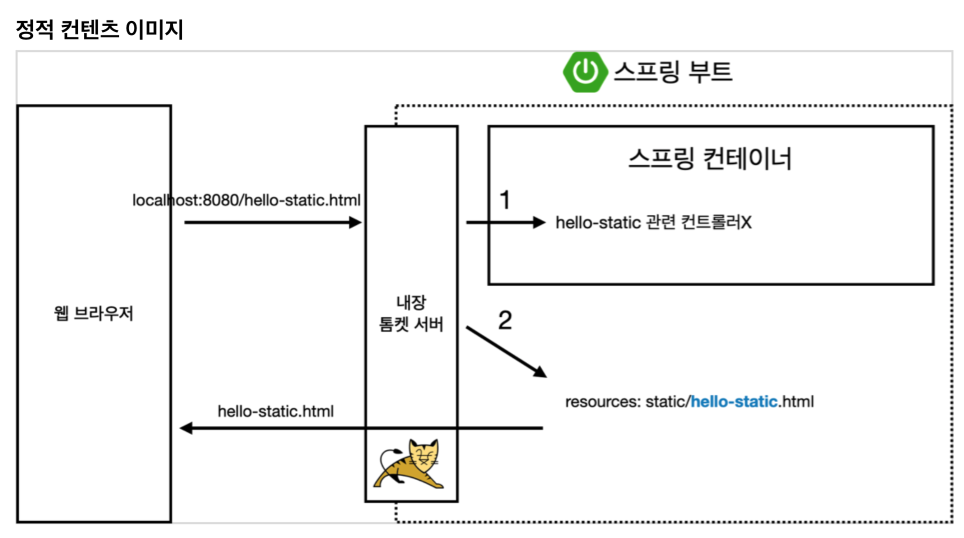
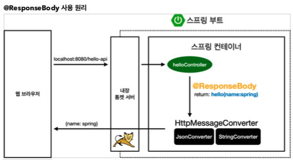

# Chapter 02 "스프링 웹 개발 기초"

* 정적 컨텐츠 - 파일을 그대로
* 템플릿 엔진 - html을 서버에서 프로그래밍 해서 동적으로 내려주는 것
* API - 클라이언트에게 json 이라는 데이터 구조 포맷으로 데이터를 전달 OR 서버끼리 통신하여 데이터 흐름

## 1. 정적 컨텐츠

* 스프링 부트 정적 컨텐츠 기능
* https://docs.spring.io/spring-boot/docs/2.3.1.RELEASE/reference/html/spring-boot- features.html#boot-features-spring-mvc-static-content
```html
By default, Spring Boot serves static content from a directory called /static (or /public or /resources or /META-INF/resources) 
in the classpath or from the root of the ServletContext.
```

* 컨트롤러가 우선순위를 가짐<br>
1 컨트롤러에 맵핑된 것이 없으므로 2 에서 static 컨텐츠를 찾음.

## 2. MVC와 템플릿 엔진
* MVC: Model, View, Controller
* 관심사 분리 / 역할과 책임

> Controller
* `@RequestParam(value="name", required = true)` 또는 `@RequestParam("name")` 로 하고 `http://localhost:8080/hello-mvc` 를 실행하면 → ERROR 발생
* 그러나 `required=false` 옵션을 주면, `hello null` 출력 
```java
@Controller
public class HelloController {
...
    /**
     * MVC와 템플릿 엔진
     * @param name
     * @param model
     * @return
     */
    @GetMapping("hello-mvc")    // 실행: http://localhost:8080/hello-mvc?name=spring
    ublic String helloMvc(@RequestParam(value="name", required = false) String name, Model model) {
        // Model 은 화면을 랜더링 할때 사용함.
        model.addAttribute("name", name);
        return "hello-template";
    }
}
```

> View - 웹 프라우저 > 소스보기
* 템플릿 엔진 처리된 html 파일의 소스가 보임.
```html
<html>
<body>
<p>hello null</p>
</body>
</html>
```


## 3. API

### 3.1. ResponseBody

> Controller

* `@ResponseBody` 를 사용하면 `viewResolver`를 사용하지 않음
* 대신에 HTTP의 BODY에 문자 내용을 직접 반환(HTML BODY TAG를 말하는 것이 아님)

```java
    /**
     * ResponseBody의 개념
     * @param name
     * @return
     */
    @GetMapping("hello-string")
    @ResponseBody   // http 에서 body 부에 이 데이터를 직접 넣어 주겠다는 의미.
    public String helloString(@RequestParam("name") String name) {
        return "hello " + name; // 요청한 클라이언트에게 그대로 내려감(View 가 없음)
    }
```

> View - 웹 프라우저 > 소스보기
* HTTP의 BODY에 문자 내용을 직접 반환
```html
hello hi!
```

### 3.2. API객체 전달

* 데이터를 반환하기 위해 API방식을 사용.
* @ResponseBody 를 사용하고, 객체를 반환하면 객체가 JSON으로 변환됨

> Controller
```java
    /**
     * 객체 전달 & json
     * @param name
     * @return
     */
    @GetMapping("hello-api")
    @ResponseBody   // json 반환이 기본
    public Hello helloApi(@RequestParam("name") String name) {
        Hello hello = new Hello();
        hello.setName(name);
        return hello;   // 객체를 넘김
    }
```

> View - 웹 프라우저 > 소스보기
```html
{"name":"hello!"}
```

> JSON // TODO

### 3.3. @ResponseBody 사용 원리



* `@ResponseBody` 를 사용 → 반환한 객체를 json 데이터로 넘김
* HTTP의 BODY에 문자 내용을 직접 반환
* `viewResolver` 대신에 `HttpMessageConverter` 가 동작
    * 기본 문자처리: `StringHttpMessageConverter`
    * 기본 객체처리: `MappingJackson2HttpMessageConverter`
        * 객체를 json으로 바꿔주는 대표 라이브러리 2개 - jackson, gson <br>
        (spring은 jackson을 기본으로 채택 - 범용성, 검증성)
    * byte 처리 등등 기타 여러 HttpMessageConverter가 기본으로 등록되어 있음
    * [참고] 클라이언트의 HTTP Accept 헤더와 서버의 컨트롤러 반환 타입 정보 둘을 조합해서 HttpMessageConverter 가 선택된다.


