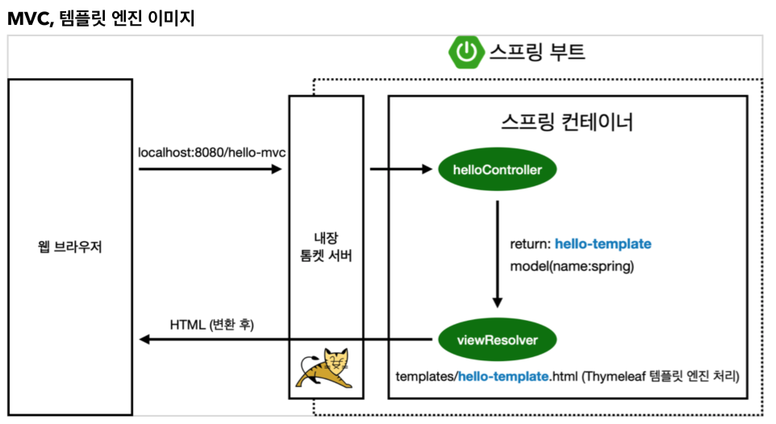
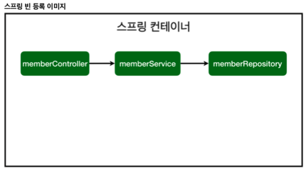

# Chapter 04 "백엔드 개발 - 스프링 빈과 의존관계"

> 스프링 빈을 등록하는 2가지 방법 
> * 컴포넌트 스캔과 자동 의존관계 설정 
> * 자바 코드로 직접 스프링 빈 등록하기

## 1. 컴포넌트 스캔과 자동 의존관계 설정 
* 회원 컨트롤러가 회원서비스와 회원 리포지토리를 사용할 수 있게 의존관계를 준비하자.



### 1.1. 컨트롤러에 의존관계 추가

* `@Controller` - 스프링 빈으로 자동 등록되어, 스프링 컨테이너가 관리함.
* 스프링 컨테이너로 등록하고, 스프링 컨테이너로 받아서 쓰도록 바꾸어야 함. 
    * 여러 Controller에서 하나의 Service를 사용할 때마다 여러개의 인스턴스를 생성해서 사용할 필요가 없음.
    * 하나만 생성해서 공용으로 쓰면 됨. → 스프링 컨테이너에 등록하면 1개만 등록됨.
* 생성자에 `@Autowired` 가 있으면 스프링이 연관된 객체를 스프링 컨테이너에서 찾아서 넣어줌.
    * DI (Dependency Injection), 의존성 주입 - 객체 의존관계를 외부에서 넣어주는 것

```java
@Controller
public class MemberController {

    // private final MemberService memberSerivce = new MemberService();
    private final MemberService memberService;

    @Autowired // 생성자 호출시 Autowired → 스프링이 스프링 컨테이너에 있는 memberService를 가져와서 연결시켜줌.
    public MemberController(MemberService memberService) {
        this.memberService = memberService;
    }
}
```

* 위 소스코드 실행시 에러 발생 - memberService가 스프링 빈으로 등록되어 있지 않으므로.<br>
→ `@Service`, `@Repository` 어노테이션 추가
```
Description:
Parameter 0 of constructor in hola.springbasic.Controller.MemberController required a bean of type 'hola.springbasic.service.MemberService' that could not be found.

Action:
Consider defining a bean of type 'hola.springbasic.service.MemberService' in your configuration.
```
```java
@Service
public class MemberService {

    // 회원 서비스가 메모리 회원 리포지토리를 직접 생성하게 함.
    // private final MemberRepository memberRepository = new MemoryMemberRepository();
    private final MemberRepository memberRepository;

    // Constructor 생성 - 직접 new 로 생성하는 것이 아니라, 외부에서 넣어주도록 함.
    // Dependency Injection (DI)
    @Autowired
    public MemberService(MemberRepository memberRepository) {
        this.memberRepository = memberRepository;
    }
...
}
```

### 1.2. 컴포넌트 스캔 원리


* `@Component` 애노테이션이 있으면 스프링 빈으로 자동 등록된다.
* `@Controller` 컨트롤러가 스프링 빈으로 자동 등록된 이유도 컴포넌트 스캔 때문이다.
* `@Component` 를 포함하는 다음 애노테이션도 스프링 빈으로 자동 등록된다. 
    * `@Controller`
    * `@Service`
    * `@Repository`
* 생성자에 `@Autowired` 를 사용하면 객체 생성 시점에 스프링 컨테이너에서 해당 스프링 빈을 찾아서 주입한다. 
    * 생성자가 1개만 있으면 @Autowired 는 생략할 수 있다.
* 기본적으로, main 클래스가 있는 패키지 하위의 클래스만 컴포넌트 스캔 가능하다.
    * `@SpringBootApplication` 어노테이션 하위.
* 기본적으로, 스프링은 스프링 컨테이너에 스프링 빈을 등록할 때, 싱글톤으로 등록한다.
    * 유일하게 하나만 등록해서 공유한다. (메모리 절약 등)
    * → 같은 스프링 빈이면 모두 같은 인스턴스다. 

## 2. 자바 코드로 직접 스프링 빈 등록하기
* 회원 서비스와 회원 리포지토리의 @Service, @Repository, @Autowired 애노테이션을 제거하고 진행한다.<br>
(회원 컨트롤러는 그대로 둠.)

```java
@Configuration
public class SpringConfig {
    @Bean   // 스프링 빈으로 등록할거야!
    public MemberService memberService() {
        return new MemberService(memberRepository());
    }
    @Bean
    public MemberRepository memberRepository() {    // Interface (New 불가)
        return new MemoryMemberRepository();    // 구현체
    }
}
```

* XML로 설정하는 방식도 있지만 최근에는 잘 사용하지 않음.
* DI 의 3가지 방법 - 의존관계가 실행중에 동적으로 변하는 경우는 거의 없으므로 생성자 주입을 권장함.<br>
(실행중에 동적으로 변경된다: 서버가 떠있는 상태에서 변경 사항을 적용한다.)
    * `생성자 주입` - 애플리케이션 조립 시점에(=스프링 컨테이너에 올라갈 때) memberService가 주입되고, 이후에 변경되지 않도록 막음.
    ```java
    @Controller
    public class MemberController {
    
        // private final MemberService memberSerivce = new MemberService();
        private final MemberService memberService;
    
        @Autowired // 생성자 호출시 Autowired → 스프링이 스프링 컨테이너에 있는 memberService를 가져와서 연결시켜줌.
        public MemberController(MemberService memberService) {
            this.memberService = memberService;
        }
    }
    ```
    * 필드 주입
    ```java
    @Controller
    public class MemberController {
    
        // private final MemberService memberSerivce = new MemberService();
        @Autowired private MemberService memberService;
    
    //    @Autowired // 생성자 호출시 Autowired → 스프링이 스프링 컨테이너에 있는 memberService를 가져와서 연결시켜줌.
    //    public MemberController(MemberService memberService) {
    //        this.memberService = memberService;
    //    }
    }
    ```
    * setter 주입 - public 하게 노출됨
    ```java
    @Controller
    public class MemberController {
    
        // setter 주입
        private MemberService memberService;
    
        @Autowired
        public void MemberService(MemberService memberService) {
            this.memberService = memberService;
        }
    }
    ```
* 실무에서는 주로 정형화된 컨트롤러, 서비스, 리포지토리 같은 코드는 컴포넌트 스캔을 사용한다. <br>
그리고 ***정형화 되지 않거나, 상황에 따라 구현 클래스를 변경해야 하면 설정을 통해 스프링 빈으로 등록한다.***
    * 예: MemoryMemberRepository 구현체를 다른 리파지토리로 바꿀때 → 설정파일 SpringConfig 만 수정하면 됨.
* `@Autowired` 를 통한 DI는 HelloConroller, MemberService 등과 같이 스프링이 관리하는 객체에서만 동작한다. <br>
스프링 빈으로 등록하지 않고 내가 직접 생성한 객체에서는 동작하지 않는다. (스프링 컨테이너에 반드시 올라가야 함)
