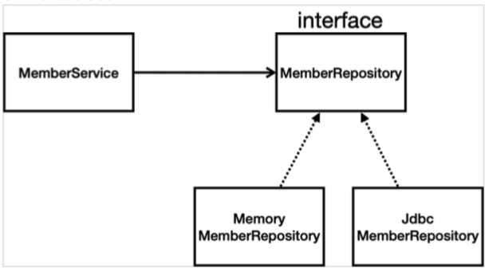
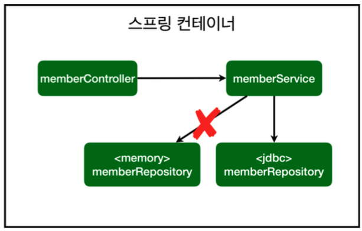
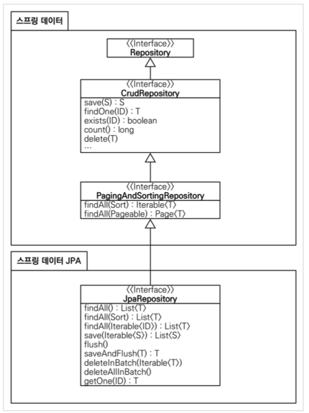

# Chapter 06 "스프링 DB 접근 기술 - 스프링 데이터 엑세스"

## 1. H2 데이터베이스 설치

### 1.1. H2 DB 설치
* 개발이나 테스트 용도로 가볍고 편리한 DB, 웹 화면 제공
* https://www.h2database.com 에서 다운로드 및 설치
    * 권한 주기: chmod 755 h2.sh (윈도우 사용자는 x) 
    * 실행: ./h2.sh (윈도우 사용자는 h2.bat) 
    * 데이터베이스 파일 생성 방법
        * jdbc:h2:~/test (최초 한번)
        * ~/test.mv.db 파일 생성 확인
        * 이후부터는 jdbc:h2:tcp://localhost/~/test 이렇게 접속
        
### 1.2. [local에 h2 DB 설치하지 않고, dependency에 추가하여 사용하기](https://bgpark.tistory.com/78)
* In-memory 방식 지원 / Application 에 내장(Embeded) 되어 실행
* dependency - build.gradle
```
dependencies {  // 프로젝트 개발에 필요한 의존성 선언
    ...
    implementation 'org.springframework.boot:spring-boot-starter-jdbc'
    runtimeOnly 'com.h2database:h2:1.4.197'  // h2 Database
}
```
* configuration - application.properties
```properties
spring.h2.console.enabled=true
spring.h2.console.path=/h2-console

spring.datasource.url=jdbc:h2:~/test;
spring.datasource.username=sa
spring.datasource.password=
spring.jpa.database-platform=org.hibernate.dialect.H2Dialect
```
* h2접속 - localhost:8080/h2-console
    * `Database "mem:testdb" not found, either pre-create it or allow remote database creation (not recommended in secure environments)`: 데이터베이스를 보안상의 이유로 생성을 못하게 h2 기본 설정 자체에서 막아놓음. <br>
    → 해결책 -  h2의 버전을 1.4.198보다 낮은 버전으로 설정

## 1.2. 테이블 생성하기

* 테이블 관리를 위해 `resources` 폴더에 schema.sql, data.sql 을 생성
 
## 2. 순수 Jdbc

### 2.1. Jdbc 리파지토리 구현 

```java
public class JdbcMemberRepository implements MemberRepository {

    private final DataSource dataSource;

    public JdbcMemberRepository(DataSource dataSource) {    // Spring을 통해 dataSource를 주입 받아야 함.
        this.dataSource = dataSource;
    }

    private Connection getConnection() {
        return DataSourceUtils.getConnection(dataSource);   // DataSourceUtils 를 통하여 Connection 획득
    }

    private void close(Connection conn, PreparedStatement pstmt, ResultSet rs) {
        try {
            if (rs != null) {
                rs.close();
            }
        } catch (SQLException e) {
            e.printStackTrace();
        }
        try {
            if (pstmt != null) {
                pstmt.close();
            }
        } catch (SQLException e) {
            e.printStackTrace();
        }
        try {
            if (conn != null) {
                close(conn);
            }
        } catch (SQLException e) {
            e.printStackTrace();
        }
    }

    private void close(Connection conn) throws SQLException {
        DataSourceUtils.releaseConnection(conn, dataSource);    // DataSourceUtils 를 통하여 자원 release.
    }

    @Override
    public Member save(Member member) {
        String sql = "insert into member(name) values(?)";  // parameter 바인딩을 위해 ? 처리

        Connection conn = null;
        PreparedStatement pstmt = null;
        ResultSet rs = null;

        try {   // exception이 많아 반드시 try catch 문 써주어야 함.
            conn = getConnection();
            pstmt = conn.prepareStatement(sql, Statement.RETURN_GENERATED_KEYS);

            pstmt.setString(1, member.getName());

            pstmt.executeUpdate();  // DB에 실제 쿼리 실행
            rs = pstmt.getGeneratedKeys();  // Statement.RETURN_GENERATED_KEYS 설정에 의해 만들어진 key를 꺼내줌.

            if (rs.next()) {
                member.setId(rs.getLong(1));
            } else {
                throw new SQLException("id 조회 실패");
            }
            return member;
        } catch (Exception e) {
            throw new IllegalStateException(e);
        } finally { // resource release 해주어야 함.
            close(conn, pstmt, rs);
        }
    }
...
}
```
* insert: pstmt.executeUpdate()
* select: pstmt.executeQuery()

### 2.2. 스프링 설정 변경 - SpringConfig

```java
@Configuration
public class SpringConfig {

    private DataSource dataSource;  // 스프링이 자체적으로 DataSource를 만들어 줌.

    @Autowired  // 주입
    public SpringConfig(DataSource dataSource) {
        this.dataSource = dataSource;
    }

    @Bean   // 스프링 빈으로 등록할거야!
    public MemberService memberService() {
        return new MemberService(memberRepository());
    }

    /**
     * 오직 구현체만 바꿈으로써(=애플리케이션을 조립하는 코드만 바꿈으로써) 설정을 바꿔주면
     * 나머지 실제 서비스 코드는 손대지 않아도 됨.
     */
    @Bean
    public JdbcMemberRepository memberRepository() {    // Interface (New 불가)
//        return new MemoryMemberRepository();    // 구현체
        return new JdbcMemberRepository(dataSource);
    }
}
```

* 객체지향적인 설계가 좋음, 다형성 활용 - Interface 를 두고 구현체 replace를 할 수 있음! 스프링이 이것을 지원해줌(DI)
* DataSource는 데이터베이스 커넥션을 획득할 때 사용하는 객체
* 스프링 부트는 데이터베이스 커넥션 정보를 바탕으로 DataSource를 생성하고 스프링 빈으로 만들어둔다. <br>
→ 그래서 DI를 받을 수 있다.

* 구현클래스
    * 
* 스프링 컨테이너
    * 

* 개방-폐쇄 원칙(OCP, Open-Closed Principle) 
    * 확장에는 열려있고, 수정, 변경에는 닫혀있다.
* 스프링의 DI (Dependencies Injection)을 사용하면 기존 코드를 전혀 손대지 않고, 설정만으로 구현 클래스를 변경할 수 있다.

## 3. 스프링 통합 테스트 

* `@SpringBootTest` : 스프링 컨테이너와 테스트를 함께 실행한다.
* `@Transactional` : 테스트 케이스에 이 애노테이션이 있으면, 테스트 시작 전에 트랜잭션을 시작하고, 테스트 완료 후에 항상 롤백한다.<br>
→ DB에 데이터가 남지 않으므로 다음 테스트에 영향을 주지 않는다.

```java
@SpringBootTest // 스프링 컨테이너와 테스트를 함께 실행
@Transactional  // 테스트 완료 후에 항상 롤백
class MemberServiceIntegrationTest {

    @Autowired
    MemberService memberService;
    @Autowired
    MemberRepository memberRepository;

    @Test
    void 회원가입() { // 빌드될 때, 테스트 코드는 실제 코드에 포함되지 않음.
        // given
        Member member = new Member();
        member.setName("hello");

        // when
        Long savedId = memberService.join(member);

        // then
        Member findMember = memberService.findOne(savedId).get();
        assertEquals(member.getName(), findMember.getName());
    }
...
}
```

## 4. 스프링 JdbcTemplate

* 순수 Jdbc와 동일한 환경설정을 하면 된다.
* 스프링 JdbcTemplate과 MyBatis 같은 라이브러리는 JDBC API에서 본 반복 코드를 대부분 제거해준다.
* 하지만 SQL은 직접 작성해야 한다.

### 4.1. Jdbc 리파지토리 구현 

```java
public class JdbcTemplateMemberRepository implements MemberRepository {

    private final JdbcTemplate jdbcTemplate;

    @Autowired  // 생성자가 1개만 있으면 autowired 생략 가능.
    public JdbcTemplateMemberRepository(DataSource dataSource) {
        jdbcTemplate = new JdbcTemplate(dataSource);
    }

    @Override
    public Member save(Member member) {
        SimpleJdbcInsert jdbcInsert = new SimpleJdbcInsert(jdbcTemplate);
        jdbcInsert.withTableName("member").usingGeneratedKeyColumns("id");  // 쿼리 작성할 필요가 없음.

        Map<String, Object> parameters = new HashMap<>();
        parameters.put("name", member.getName());

        Number key = jdbcInsert.executeAndReturnKey(new MapSqlParameterSource(parameters)); // key 받아옴.
        member.setId(key.longValue());
        return member;
    }

    @Override
    public Optional<Member> findById(Long id) {
        List<Member> result = jdbcTemplate.query("select * from member where id = ? ", memberRowMapper(), id);
        return result.stream().findAny();
    }

    @Override
    public List<Member> findAll() {
        return jdbcTemplate.query("select * from member", memberRowMapper());
    }

    @Override
    public Optional<Member> findByName(String name) {
        List<Member> result = jdbcTemplate.query("select * from member where name = ? ", memberRowMapper(), name);
        return result.stream().findAny();
    }

    private RowMapper<Member> memberRowMapper() {
//        return new RowMapper<Member>() { // option + Enter → lamda 전환
//            @Override
//            public Member mapRow(ResultSet rs, int rowNum) throws SQLException {
//                Member member = new Member();
//                member.setId(rs.getLong("id"));
//                member.setName(rs.getString("name"));
//                return member;
//            }
//        };
        return (rs, rowNum) -> {
            Member member = new Member();
            member.setId(rs.getLong("id"));
            member.setName(rs.getString("name"));
            return member;
        };
    }
}
```

### 4.2. 스프링 설정 변경 - SpringConfig

```java
@Configuration
public class SpringConfig {

    ...
    /**
     * 오직 구현체만 바꿈으로써(=애플리케이션을 조립하는 코드만 바꿈으로써) 설정을 바꿔주면
     * 나머지 실제 서비스 코드는 손대지 않아도 됨.
     */
    @Bean
    public JdbcTemplateMemberRepository memberRepository() {    // Interface (New 불가)
//        return new MemoryMemberRepository();    // 구현체
//        return new JdbcMemberRepository(dataSource);
        return new JdbcTemplateMemberRepository(dataSource);
    }
}
```

## 5. JPA
* JPA는 기존의 반복 코드는 물론이고, 기본적인 SQL도 JPA가 직접 만들어서 실행해준다.(개발자가 직접 쿼리를 작성할 필요가 없다.)<br>
→ 개발 생산성을 크게 높일 수 있다.
* SQL과 데이터 중심의 설계에서 객체 중심의 설계로 패러다임을 전환을 할 수 있다. 

> [Spring JPA - ORM과 JPA 그리고 Hibernate](https://victorydntmd.tistory.com/195)
> * ORM(Object Relational Mapping): 객체와 관계형 DB 테이블의 맵핑
> * JPA: 자바 ORM 기술에 대한 API 표준 명세. 즉, ORM 을 사용하기 위한 인터페이스를 모아둔 것<br>
> → JPA를 구현한 Hibernate와 같은 ORM 프레임워크 사용

### 5.1. JPA 설정 추가

* build.gradle
    * `spring-boot-starter-data-jpa` 는 내부에 jdbc 관련 라이브러리를 포함한다. 
```shell script
dependencies {  // 프로젝트 개발에 필요한 의존성 선언
    implementation 'org.springframework.boot:spring-boot-starter-thymeleaf'
    implementation 'org.springframework.boot:spring-boot-starter-web'
    // implementation 'org.springframework.boot:spring-boot-starter-jdbc'
    implementation 'org.springframework.boot:spring-boot-starter-data-jpa' // 내부에 jdbc 관련 라이브러리를 포함하므로 jdbc는 제거해도 된다.
    testImplementation 'org.springframework.boot:spring-boot-starter-test'
    runtimeOnly 'com.h2database:h2:1.4.197'  // h2 Database
}
```

* resources/application.properties
    * `show-sql` : JPA가 생성하는 SQL을 출력한다.
    * `ddl-auto` : JPA는 테이블을 자동으로 생성하는 기능을 제공하는데 none 를 사용하면 해당 기능을 끈다.
        * `create`를 사용하면 엔티티 정보를 바탕으로 테이블도 직접 생성해준다.

```properties
# JPA 설정
spring.jpa.show-sql=true
spring.jpa.hibernate.ddl-auto=none
```

### 5.2. JPA 엔티티 매핑

```java
@Entity // JPA가 관리하는 Entity가 됨.
public class Member {

    @Id @GeneratedValue(strategy = GenerationType.IDENTITY)// PK 맵핑
    private Long id;
    private String name;

    public Long getId() {
        return id;
    }

    public Member setId(Long id) {
        this.id = id;
        return this;
    }

    public String getName() {
        return name;
    }

    public Member setName(String name) {
        this.name = name;
        return this;
    }
}
```

### 5.3. JPA 리파지토리 구현 

```java
public class JpaMemberRepository implements MemberRepository {

    // JPA는 EntityManager 로 모든 것이 동작한다.
    private final EntityManager em;

    public JpaMemberRepository(EntityManager em) {
        this.em = em;
    }

    @Override
    public Member save(Member member) {
        em.persist(member);
        return member;
    }

    @Override
    public Optional<Member> findById(Long id) {
        return Optional.ofNullable(em.find(Member.class, id));
    }

    @Override
    public List<Member> findAll() {
        return em.createQuery("select m from Member as m", Member.class)    // Member Entity 자체를 select 함.
                .getResultList();
    }

    @Override
    public Optional<Member> findByName(String name) {
       List<Member> result = em.createQuery("select m from Member as m where m.name = :name", Member.class)
                .setParameter("name", name)
                .getResultList();
       return result.stream().findAny();
    }
}
```

### 5.4. 서비스 계층에 트랜잭션 추가
* **JPA를 통한 모든 데이터 변경은 트랜잭션 안에서 실행해야 한다.**
* 스프링은 해당 클래스의 메서드를 실행할 때 트랜잭션을 시작하고, 메서드가 정상 종료되면 트랜잭션을 커밋한다. 만약 런타임 예외가 발생하면 롤백한다.
```java
import org.springframework.transaction.annotation.Transactional;

@Transactional
public class MemberService {...}
```

### 5.5. 스프링 설정 변경 - SpringConfig

```java
@Configuration
public class SpringConfig {

    private final EntityManager em; // JPA는 EntityManager 로 모든 것이 동작한다.

    @Autowired  // 주입
    public SpringConfig(EntityManager em) {
        this.em = em;
    }

    @Bean   // 스프링 빈으로 등록할거야!
    public MemberService memberService() {
        return new MemberService(memberRepository());
    }

    /**
     * 오직 구현체만 바꿈으로써(=애플리케이션을 조립하는 코드만 바꿈으로써) 설정을 바꿔주면
     * 나머지 실제 서비스 코드는 손대지 않아도 됨.
     * @return
     */
    @Bean
    public MemberRepository memberRepository() {    // Interface (New 불가)
//        return new MemoryMemberRepository();    // 구현체
//        return new JdbcMemberRepository(dataSource);
//        return new JdbcTemplateMemberRepository(dataSource);
        return new JpaMemberRepository(em);
    }
}
```


## 6. 스프링 데이터 JPA

* 리포지토리에 구현 클래스 없이 인터페이스 만으로 개발을 완료할 수 있음.
* 스프링 부트와 JPA라는 기반 위에, 스프링 데이터 JPA라는 프레임워크를 더하는 것임.
* 단순 반복 개발 코드가 확연히 줄어듬(예: CRUD) → 개발자는 핵심 비즈니스 로직 개발에 집중
* [주의] 스프링 데이터 JPA는 JPA를 편리하게 사용하도록 도와주는 기술임. → JPA를 먼저 학습한 후에 스프링 데이터 JPA를 학습해야 함.

### 6.1. 스프링 데이터 JPA 회원 리포지토리

* interface 만 있음에도 불구하고, 스프링 데이터 JPA가 SpringDataJpaMemberRepository 의 구현체를 자동으로 만들어서 스프링 빈에 등록해줌.

```java
// interface 는 다중 상속 가능하다. (implements 말고 extends 사용)
public interface SpringDataJpaMemberRepository extends JpaRepository<Member, Long>, MemberRepository {

    @Override
    Optional<Member> findById(Long aLong);
}
```

```java
public interface JpaRepository<T, ID> extends PagingAndSortingRepository<T, ID>, QueryByExampleExecutor<T> {
    ...
}
```

### 6.2. 스프링 설정 변경 - SpringConfig

* 스프링 데이터 JPA가 `SpringDataJpaMemberRepository` 를 스프링 빈으로 자동 등록해줌.
* 스프링 데이터 JPA가 스프링 JPA 기술을 가져다 쓰는 것.

```java
@Configuration
public class SpringConfig {

//    private DataSource dataSource;  // 스프링이 자체적으로 DataSource를 만들어 줌.
//    private final EntityManager em;   //JPA
    private final MemberRepository memberRepository;

    @Autowired  // 주입
    public SpringConfig(MemberRepository memberRepository) {
        this.memberRepository = memberRepository;
    }

    @Bean   // 스프링 빈으로 등록할거야!
    public MemberService memberService() {
        return new MemberService(memberRepository);
    }
}
```

### 6.3. 스프링 데이터 JPA 제공 클래스



* JpaRepository 안에 기본 메서드들이 정의되어 있음.

```java
@NoRepositoryBean
public interface JpaRepository<T, ID> extends PagingAndSortingRepository<T, ID>, QueryByExampleExecutor<T> {

	/*
	 * (non-Javadoc)
	 * @see org.springframework.data.repository.CrudRepository#findAll()
	 */
	@Override
	List<T> findAll();
    ...
}
```


* 스프링 데이터 JPA 제공 기능
    * 인터페이스를 통한 기본적인 CRUD
    * `findByName()`, `findByEmail()` 처럼 메서드 이름 만으로 조회 기능 제공 
    * 페이징 기능 자동 제공
    * [참고] 실무에서는 JPA와 스프링 데이터 JPA를 기본으로 사용하고, 복잡한 동적 쿼리는 Querydsl이라는 라이브러리를 사용.
        * Querydsl을 사용하면 쿼리도 자바 코드로 안전하게 작성할 수 있고, 동적 쿼리도 편리하게 작성할 수 있음.
        * 이 조합으로 해결하기 어려운 쿼리는 JPA가 제공하는 네이티브 쿼리를 사용하거나, 앞서 학습한 스프링 JdbcTemplate를 사용.