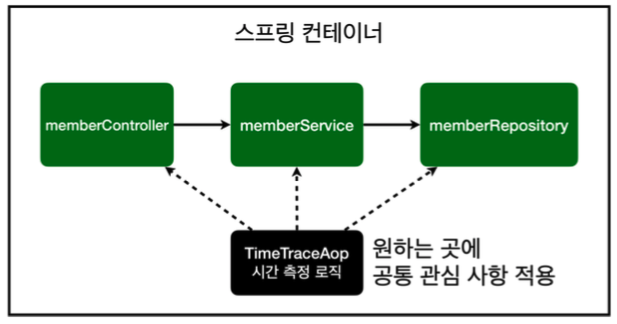
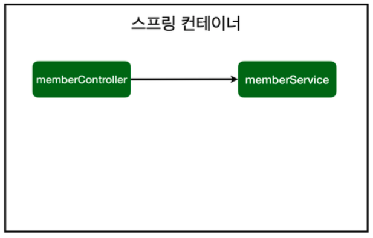
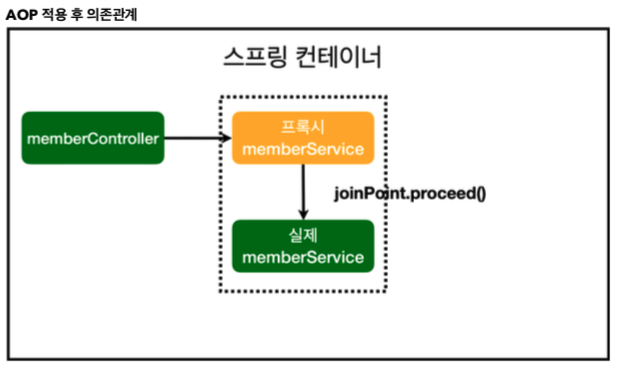
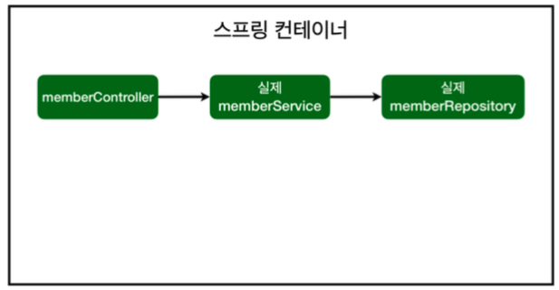
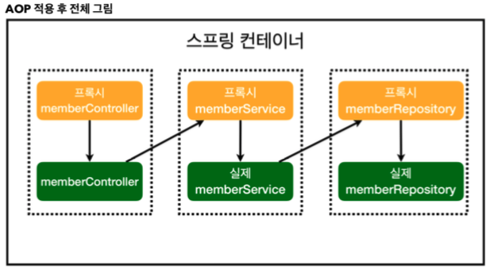

# Chapter 07 "AOP"

## 1. AOP가 필요한 상황

* [상황 예] 모든 메소드 회원 가입 시간, 회원 조회의 호출 시간을 측정하고 싶다면?<br>
→ 이 기능은 핵심 관심 사항이 아니고, 공통 관심 사항임.
* [문제] 각 메서드마다 회원 조회 시간 측정 로직을 넣는다면? 
    * 회원가입, 회원 조회에 시간을 측정하는 기능은 핵심 관심 사항이 아니다. 시간을 측정하는 로직은 공통 관심 사항이다.
    * 시간을 측정하는 로직과 핵심 비즈니스의 로직이 섞여서 유지보수가 어렵다. 
    * 시간을 측정하는 로직을 별도의 공통 로직으로 만들기 매우 어렵다.
    * 시간을 측정하는 로직을 변경할 때 모든 로직을 찾아가면서 변경해야 한다.
* [해결]
    * 회원가입, 회원 조회등 핵심 관심사항과 시간을 측정하는 공통 관심 사항을 분리한다. 시간을 측정하는 로직 별도의 공통 로직으로 만들었다.
    * 핵심 관심 사항을 깔끔하게 유지할 수 있다.
    * 변경이 필요하면 이 로직만 변경하면 된다.
    * 원하는 적용 대상을 선택할 수 있다

> 공통 관심 사항(cross-cutting concern) vs 핵심 관심 사항(core concern) 
> * 공통 관심 사항 : 인프라/부가 기능 → 주 목적 외 필요한 부가기능들 (예: 로깅, 트랜잭션)
> * 핵심 관심 사항 : 핵심 비즈니스 로직

## 2. AOP 적용 (Aspect Oriented Programming)



* 공통 관심 사항(cross-cutting concern) vs 핵심 관심 사항(core concern) 분리
* `@Around`: 공통 관심사 적용을 위한 targeting

```java
@Aspect // AOP로 사용하기 위한 annotation
@Component  // 이렇게 해도 되고, SpringConfig에 직접 설정 등록해도 됨.
public class TimeTraceAop {

    @Around("execution(* hola.springbasic..*(..))") // 공통 관심사 적용을 위한 targeting
    public Object excecute(ProceedingJoinPoint joinPoint) throws  Throwable {
        long start = System.currentTimeMillis();
        System.out.println("STRAT: " + joinPoint.toString());
        try{
            return joinPoint.proceed();
        } finally {
            long finish = System.currentTimeMillis();
            long timeMs = finish - start;
            System.out.println("END: " + joinPoint.toString() + " " + timeMs + "ms");
        }
    }
}
```

## 3. 스프링의 AOP 동작 방식 설명 - 프록시 타입의 AOP

### 3.1. 의존 관계

* AOP 적용 전 의존관계


* AOP 적용 후 의존관계



### 3.2. 실제 Proxy가 주입되는지 콘솔에 출력해서 확인하기

```java
public MemberController(MemberService memberService) {
        this.memberService = memberService;
        System.out.println("memberService = " + memberService.getClass());
    }
}
```

* 클래스 명에 hola.springbasic.service.MemberService`$$EnhancerBySpringCGLIB$$341aa904`가 붙음 <br>
→ memberService를 복제해서 코드 조작

```
2021-07-13 07:00:04.707  INFO 96208 --- [           main] j.LocalContainerEntityManagerFactoryBean : Initialized JPA EntityManagerFactory for persistence unit 'default'
STRAT: execution(MemberService hola.springbasic.SpringConfig.memberService())
END: execution(MemberService hola.springbasic.SpringConfig.memberService()) 15ms
memberService = class hola.springbasic.service.MemberService$$EnhancerBySpringCGLIB$$341aa904
```

### 3.3. AOP 적용 전 vs 후

* AOP 적용 전 전체그림


* AOP 적용 후 전체그림

    * 스프링 컨테이너에서 자동으로 DI 주입 해줌.

